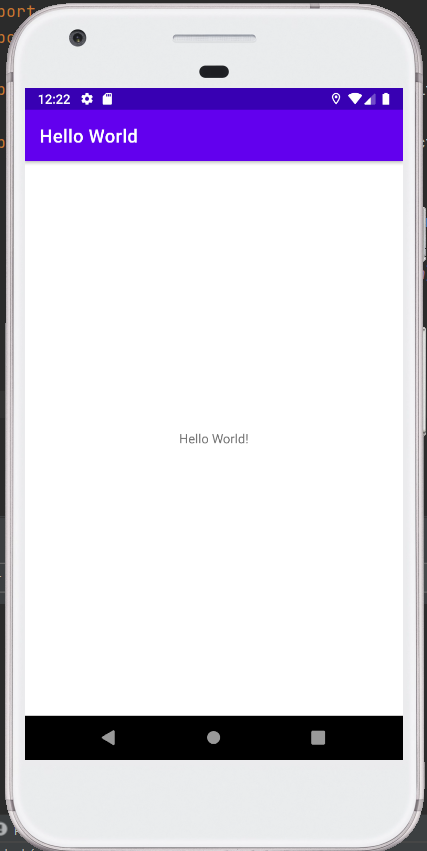
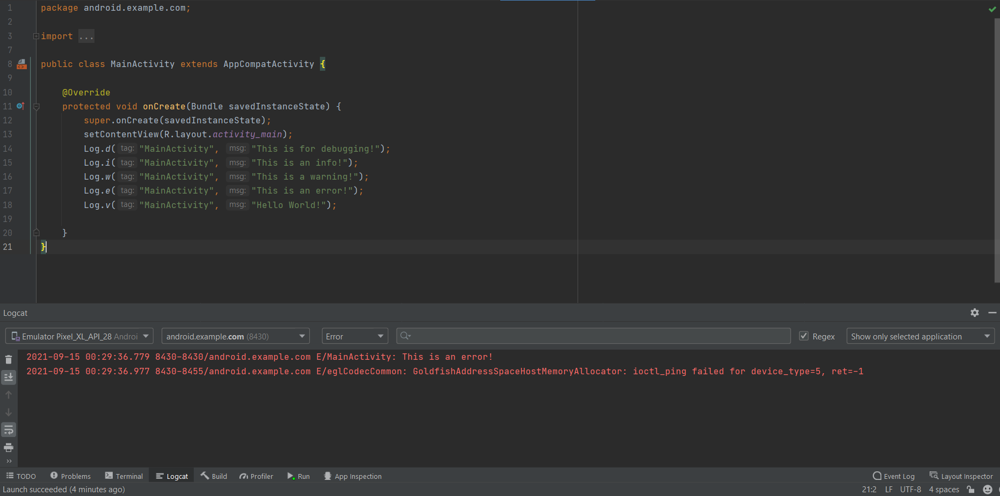

Lesson 1.1

During the first lesson, I have learnt how to create a basic mobile application project, the uses of each file within the default setup, and how to install emulators to see the results of what we built. In addition, I also become familiar with how to debug with Logcat.

Results of Homework
https://github.com/Yiranluc/cs5520project/tree/main/lesson1_1
A nutshell of hello world page:

The second picture shows using correct Logcat levels to only display debug or error logging statements.

Answers to homework

Question 1
The name of the layout file for the main activity?
activity_main.xml

Question 2
What is the name of the string resource that specifies the application's name?
app_name

Question 3
Which tool do you use to create a new emulator?
AVD Manager

Question 4
Assume that your app includes this logging statement:
Log.i("MainActivity", "MainActivity layout is complete");
You see the statement "MainActivity layout is complete" in the Logcat pane if the Log level menu is set to which of the following? (Hint: multiple answers are OK.)
Verbose and Info
