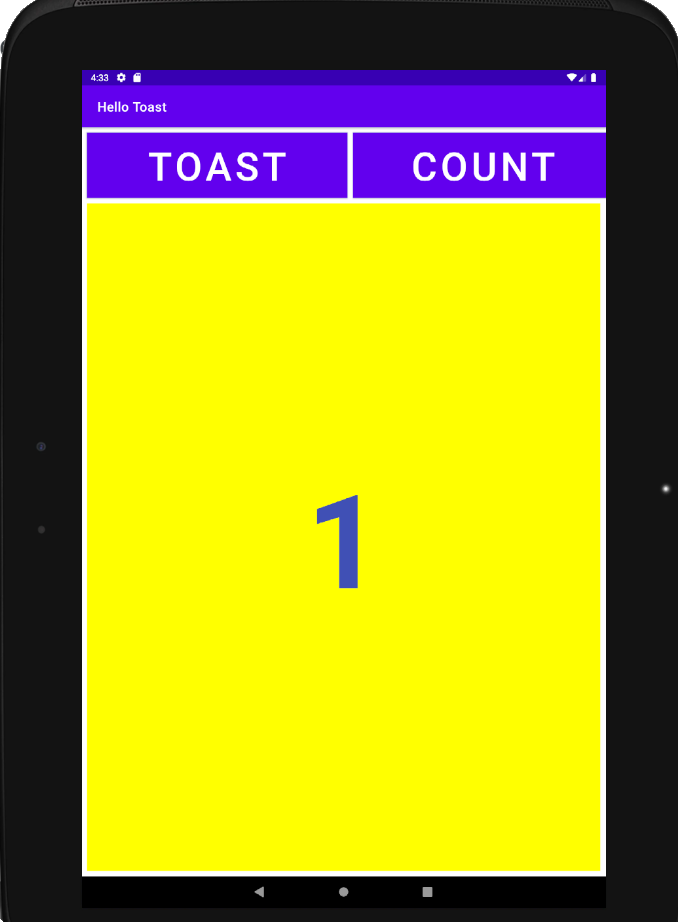
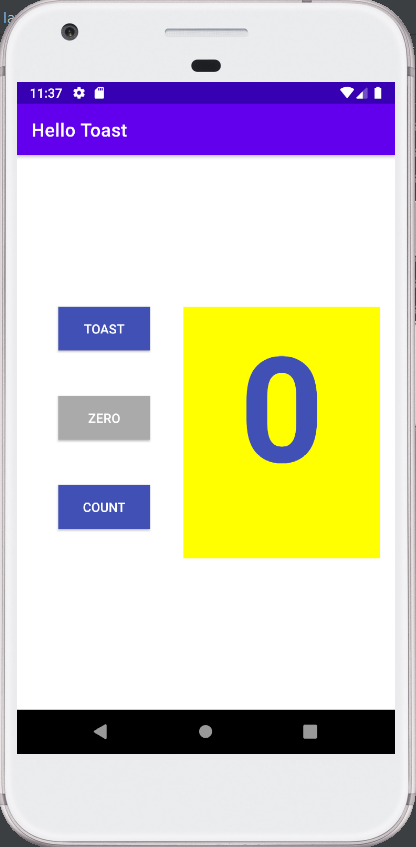
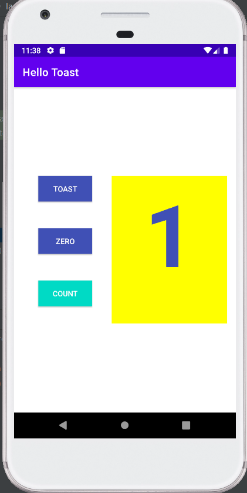
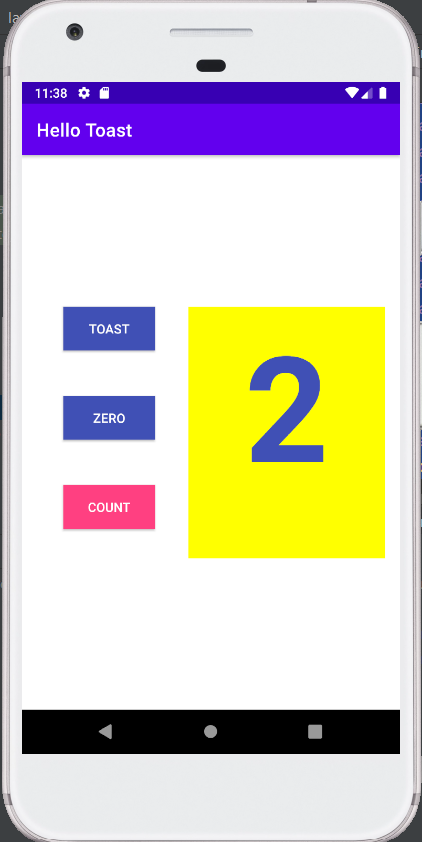

Assignment 1.2B
After this lesson, I know how to build different variants of one UI, including vertical and horizontal orientation, as well as on different devices. I also get to know how to use LinearLayout and RelativeLayout to create a page.

Results of homework
https://github.com/Yiranluc/cs5520project/tree/main/lesson1_2

Question 1
Which two layout constraint attributes on the Zero Button position it vertically equal distance between the other two Button elements? (Pick 2 answers.)
app:layout_constraintBottom_toTopOf="@+id/button_count"
app:layout_constraintTop_toBottomOf="@+id/button_toast"

Question 2
Which layout constraint attribute on the Zero Button positions it horizontally in alignment with the other two Button elements?
app:layout_constraintLeft_toLeftOf="parent"

Question 3
What is the correct signature for a method used with the android:onClick XML attribute?
public void callMethod(View view)

Question 4
The click handler for the Count Button starts with the following method signature:
public void countUp(View view)
Which of the following techniques is more efficient to use within this handler to change the Button element's background color? Choose one:

Use the view parameter that is passed to the click handler with setBackgroundColor(): view.setBackgroundColor()
