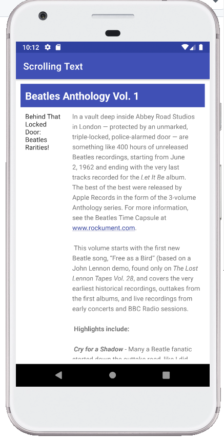
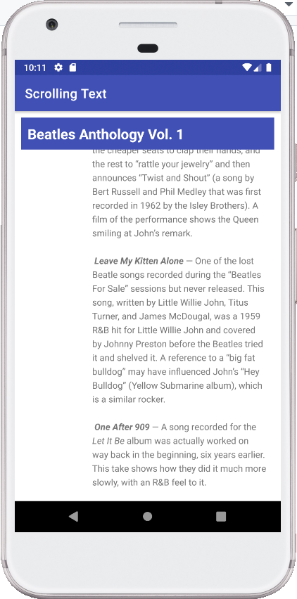

Within this class, I learnt how to design a scrollable page, add a link within texts, and put different modules on the UI in a scalable manner.

Screenshots of homework:
https://github.com/Yiranluc/cs5520project/tree/main/lesson1_3

<!--  -->
<!--  -->

Question 1
How many views can you use within a ScrollView?
One view or one view group.

Question 2
Which XML attribute do you use in a LinearLayout to show views side by side? Choose one:
android:orientation="horizontal".

Question 3
Which XML attribute do you use to define the width of the LinearLayout inside the scrolling view? Choose one:
android:layout_width="match_parent".
