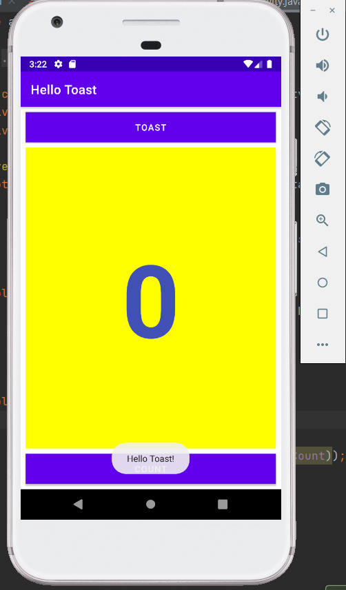
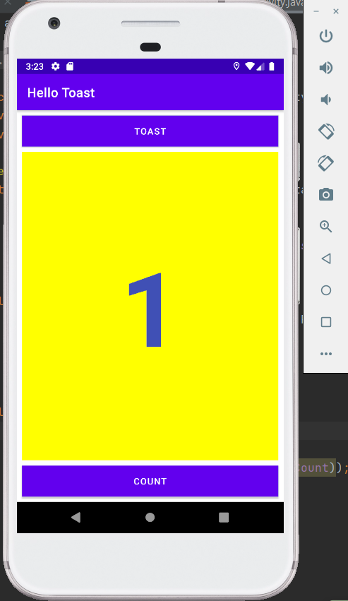

Lesson 1.2A

During this class, I built my first interative mobile application. More specifically, I got to know different View objects, how to set their attributes on the page, and how to create handlers for those View objects.

https://github.com/Yiranluc/cs5520project/tree/main/lesson1_2

Screenshots of what I created

